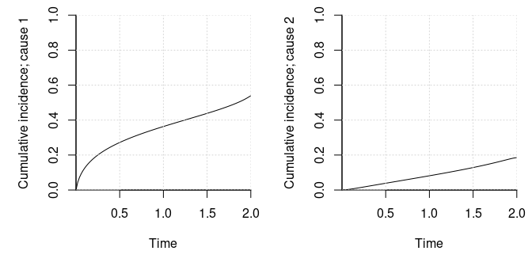
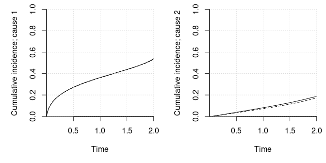

# MMCIF: Mixed Multivariate Cumulative Incidence Functions

[](https://github.com/boennecd/mmcif/actions)

This package provides an implementation of the model introduced by
Cederkvist et al. (2018) to model within-cluster dependence of both risk
and timing in competing risk.

## Installation

The package can be installed from Github by calling

``` r
library(remotes)
install_github("boennecd/mmcif")
```

The code benefits from being build with automatic vectorization so
having e.g.  `-O3` in the `CXX17FLAGS` flags in your Makevars file may
be useful.

## The Model

The conditional cumulative incidence functions for cause
 of
individual
 in
cluster
 is

 &= \pi_k(\vec z_{ij}, \vec u_i) \Phi(-\vec x_{ij}(t)^\top\vec\gamma_k - \eta_{ik}) \\ \pi_k(\vec z_{ij}, \vec u_i) &= \frac{\exp(\vec z_{ij}^\top\vec\beta_k + u_{ik})}{1 + \sum_{l = 1}^K\exp(\vec z_{ij}^\top\vec\beta_l + u_{il})} \\ \begin{pmatrix} \vec U_i \\ \vec\eta_i \end{pmatrix} &\sim N^{(2K)}(\vec 0;\Sigma).\end{align*}")

where there are

competing risks. The
^\top\vec\gamma_k")’s
for the trajectory are subject to a monotonically decreasing.

## Example

We start with a simple example where there are

competing risks and

 &= \left(\text{arcthan}\left(\frac{t - \delta/2}{\delta/2}\right), 1, a_{ij}, b_{ij}\right) \\ a_{ij} &\sim N(0, 1) \\
 b_{ij} &\sim \text{Unif}(-1, 1)\\ \vec z_{ij} &= (1, a_{ij}, b_{ij}) \end{align*}")

We set the parameters below and plot the conditional cumulative
incidences function when the random effects are zero and
.

``` r
# assign model parameters
n_causes <- 2L
delta <- 2

# set the betas
coef_risk <- c(.67, 1, .1, -.4, .25, .3) |> 
  matrix(ncol = n_causes)

# set the gammas
coef_traject <- c(-.8, -.45, .8, .4, -1.2, .15, .25, -.2) |> 
  matrix(ncol = n_causes)

# plot the conditional cumulative incidences when random effects and covariates
# are all zero
local({
  probs <- exp(coef_risk[1, ]) / (1 + sum(exp(coef_risk[1, ])))
  par(mar = c(5, 5, 1, 1), mfcol = c(1, 2))
  
  for(i in 1:2){
    plot(\(x) probs[i] * pnorm(
      -coef_traject[1, i] * atanh((x - delta / 2) / (delta / 2)) - 
        coef_traject[2, i]),
         xlim = c(1e-8, delta), ylim = c(0, 1), bty = "l",  xlab = "Time", 
         ylab = sprintf("Cumulative incidence; cause %d", i),
       yaxs = "i", xaxs = "i")
    grid()
  }
})
```



``` r
# set the covariance matrix
Sigma <- c(0.306, 0.008, -0.138, 0.197, 0.008, 0.759, 0.251, 
-0.25, -0.138, 0.251, 0.756, -0.319, 0.197, -0.25, -0.319, 0.903) |> 
  matrix(2L * n_causes)
```

Next, we assign a function to simulate clusters. The cluster sizes are
uniformly sampled from two to the maximum size. The censoring times are
drawn from a uniform distribution from zero to
.

``` r
library(mvtnorm)

# simulates a data set with a given number of clusters and maximum number of 
# observations per cluster
sim_dat <- \(n_clusters, max_cluster_size){
  stopifnot(max_cluster_size > 0,
            n_clusters > 0)
  
  cluster_id <- 0L
  apply(rmvnorm(n_clusters, sigma = Sigma), 1, \(rng_effects){
    U <- head(rng_effects, n_causes)
    eta <- tail(rng_effects, n_causes)
    
    n_obs <- sample.int(max_cluster_size - 1L, 1L) + 1L
    cluster_id <<- cluster_id + 1L
    
    # draw the cause
    covs <- cbind(a = rnorm(n_obs), b = runif(n_obs, -1))
    Z <- cbind(1, covs)
  
    cond_logits_exp <- exp(Z %*% coef_risk + rep(U, each = n_obs)) |> 
      cbind(1)
    cond_probs <- cond_logits_exp / rowSums(cond_logits_exp)
    cause <- apply(cond_probs, 1, 
                   \(prob) sample.int(n_causes + 1L, 1L, prob = prob))
    
    # compute the observed time if needed
    obs_time <- mapply(\(cause, idx){
      if(cause > n_causes)
        return(delta)
      
      # can likely be done smarter but this is more general
      coefs <- coef_traject[, cause]
      offset <- sum(Z[idx, ] * coefs[-1]) + eta[cause]
      rng <- runif(1)
      eps <- .Machine$double.eps
      root <- uniroot(
        \(x) rng - pnorm(
          -coefs[1] * atanh((x - delta / 2) / (delta / 2)) - offset), 
        c(eps^2, delta * (1 - eps)), tol = 1e-12)$root
    }, cause, 1:n_obs)
    
    cens <- runif(n_obs, max = 3 * delta)
    has_finite_trajectory_prob <- cause <= n_causes
    is_censored <- which(!has_finite_trajectory_prob | cens < obs_time)
    
    if(length(is_censored) > 0){
      obs_time[is_censored] <- pmin(delta, cens[is_censored])
      cause[is_censored] <- n_causes + 1L
    }
    
    data.frame(covs, cause = cause, time = obs_time, cluster_id)
  }, simplify = FALSE) |> 
    do.call(what = rbind)
}
```

We then sample a data set.

``` r
# sample a data set
set.seed(8401828)
n_clusters <- 1000L
max_cluster_size <- 5L
dat <- sim_dat(n_clusters, max_cluster_size = max_cluster_size)

# show some stats
NROW(dat) # number of individuals
#> [1] 3573
table(dat$cause) # distribution of causes (3 is censored)
#> 
#>    1    2    3 
#> 1527  623 1423

# distribution of observed times by cause
tapply(dat$time, dat$cause, quantile, 
       probs = seq(0, 1, length.out = 11), na.rm = TRUE)
#> $`1`
#>           0%          10%          20%          30%          40%          50% 
#> 1.037532e-06 4.393086e-03 2.549201e-02 8.553160e-02 1.954232e-01 4.183183e-01 
#>          60%          70%          80%          90%         100% 
#> 7.995275e-01 1.341151e+00 1.727572e+00 1.944052e+00 1.999995e+00 
#> 
#> $`2`
#>           0%          10%          20%          30%          40%          50% 
#> 0.0009666954 0.0601977831 0.1514903014 0.2832340702 0.4514909913 0.6938606243 
#>          60%          70%          80%          90%         100% 
#> 0.9512206696 1.3040148597 1.5707337955 1.8322967104 1.9983337883 
#> 
#> $`3`
#>           0%          10%          20%          30%          40%          50% 
#> 0.0005559647 0.3034055659 0.6145405803 0.9248298794 1.3095068850 1.8354668445 
#>          60%          70%          80%          90%         100% 
#> 2.0000000000 2.0000000000 2.0000000000 2.0000000000 2.0000000000
```

Then we setup the C++ object to do the computation.

``` r
library(mmcif)
comp_obj <- mmcif_data(
  ~ a + b, dat, cause = cause, time = time, cluster_id = cluster_id, 
  max_time = delta, spline_df = 2L)
```

The `mmcif_data` function does not work with

 = \text{arcthan}\left(\frac{t - \delta/2}{\delta/2}\right)")

but instead with
)")
where

returns a natural cubic spline basis functions. The knots are based on
quantiles of
")
evaluated on the event times. The degrees of freedom of the spline is
controlled with the `spline_df` argument. There is a `constraints`
element on the object returned by the `mmcif_data` function which
contains matrices that ensures that the
^\top\vec\gamma_k")s
are monotonically decreasing if

where 
is one of matrices and

is the concatenated vector of model parameters.

The time to compute the log composite likelihood is illustrated below.

``` r
NCOL(comp_obj$pair_indices) # the number of pairs in the composite likelihood
#> [1] 5209

# we need to find the combination of the spline bases that yield a straight 
# line. You can skip this
comb_slope <- local({
  boundary_knots <- comp_obj$spline$boundary_knots
  pts <- seq(boundary_knots[1], boundary_knots[2], length.out = 1000)
  lm.fit(cbind(1, comp_obj$spline$expansion(pts)), pts)$coef
})

# assign a function to compute the log composite likelihood
library(fastGHQuad)
#> Loading required package: Rcpp
ghq_data <- with(gaussHermiteData(5L), list(node = x, weight = w))

ll_func <- \(par, n_threads = 1L)
  mmcif:::mmcif_logLik(
    comp_obj$comp_obj, par = par, ghq_data = ghq_data, n_threads = n_threads)

# the log composite likelihood at the true parameters
coef_traject_spline <- 
  rbind(t(coef_traject[1, ] %o% comb_slope[-1]), 
        coef_traject[2, ] + comb_slope[1] * coef_traject[1, ],
        coef_traject[-(1:2), ])
true_values <- c(coef_risk, coef_traject_spline, Sigma)
ll_func(true_values)
#> [1] -8865.391

# check the time to compute the log composite likelihood
bench::mark(
  `one thread` = ll_func(n_threads = 1L, true_values),
  `two threads` = ll_func(n_threads = 2L, true_values),
  `three threads` = ll_func(n_threads = 3L, true_values),
  `four threads` = ll_func(n_threads = 4L, true_values))
#> # A tibble: 4 × 6
#>   expression         min   median `itr/sec` mem_alloc `gc/sec`
#>   <bch:expr>    <bch:tm> <bch:tm>     <dbl> <bch:byt>    <dbl>
#> 1 one thread      91.4ms   91.5ms      10.9    19.8KB        0
#> 2 two threads     47.8ms   49.4ms      20.0        0B        0
#> 3 three threads   31.9ms   33.5ms      28.5        0B        0
#> 4 four threads    24.4ms   24.6ms      39.5        0B        0
```

Then we optimize the parameters (TODO: there will be a wrapper to work
with the log Cholesky decomposition and an estimation function; the
estimation time will be much reduced when the gradient is implemented).

``` r
# find the starting values
system.time(start <- mmcif_start_values(comp_obj, n_threads = 4L))
#>    user  system elapsed 
#>   0.061   0.000   0.019

# the maximum likelihood without the random effects. Note that this is not 
# comparable with the composite likelihood
attr(start, "logLik")
#> [1] -3132.405

# computes the log Cholesky decomposition
log_chol <- \(x){
  x <- chol(x)
  diag(x) <- diag(x) |> log()
  x[upper.tri(x, TRUE)]
}
log_chol_inv <- \(x){
  dim <- (sqrt(8 * length(x) + 1) - 1) / 2
  out <- matrix(0, dim, dim)
  out[upper.tri(out, TRUE)] <- x
  diag(out) <- diag(out) |> exp()
  crossprod(out)
}

# examples of using log_chol and log_chol_inv
log_chol(Sigma)
#>  [1] -0.59208509  0.01446203 -0.13801455 -0.24947003  0.29228783 -0.24851681
#>  [7]  0.35612750 -0.29291060 -0.18532138 -0.21077242
stopifnot(all.equal(Sigma, log_chol(Sigma) |> log_chol_inv()))

# computes the log composite likelihood with a log Cholesky decomposition for
# the covariance matrix
ll_func_chol <- \(par, n_threads = 1L, ghq = ghq_data){
  n_vcov <- (2L * n_causes * (2L * n_causes + 1L)) %/% 2L
  par <- c(head(par, -n_vcov), tail(par, n_vcov) |> log_chol_inv())
  
  mmcif:::mmcif_logLik(
    comp_obj$comp_obj, par = par, ghq_data = ghq, n_threads = n_threads)
}

# set true value
truth <- c(coef_risk, coef_traject_spline, log_chol(Sigma))

# optimize the log composite likelihood
constraints <- comp_obj$constraints$vcov_lower
system.time(
  fit <- constrOptim(
    start$lower, \(par) -ll_func_chol(par, n_threads = 4L, ghq_data), 
    grad = NULL, ui = constraints, ci = rep(1e-8, NROW(constraints)),
    control = list(maxit = 10000L)))
#>     user   system  elapsed 
#> 5270.243    0.727 1318.684

# the log composite likelihood at different points
ll_func_chol(truth, 4L)
#> [1] -8865.391
ll_func_chol(start$lower, 4L)
#> [1] -9492.242
-fit$value
#> [1] -8836.451
```

The estimated and true the conditional cumulative incidence functions
when the random effects are zero and

are shown below (the dashed curves are the estimates).

``` r
local({
  # get the estimates
  coef_risk_est <- fit$par[comp_obj$indices$coef_risk] |> 
    matrix(ncol = n_causes)
  coef_traject_time_est <- fit$par[comp_obj$indices$coef_trajectory_time] |> 
    matrix(ncol = n_causes)
  coef_traject_est <- fit$par[comp_obj$indices$coef_trajectory] |> 
    matrix(ncol = n_causes)
  coef_traject_intercept_est <- coef_traject_est[3, ]
  
  # compute the risk probabilities  
  probs <- exp(coef_risk[1, ]) / (1 + sum(exp(coef_risk[1, ])))
  probs_est <- exp(coef_risk_est[1, ]) / (1 + sum(exp(coef_risk_est[1, ])))
  
  # plot the estimated and true conditional cumulative incidence functions. The
  # estimates are the dashed lines
  par(mar = c(5, 5, 1, 1), mfcol = c(1, 2))
  pts <- seq(1e-8, delta, length.out = 1000)
  
  for(i in 1:2){
    true_vals <- probs[i] * pnorm(
      -coef_traject[1, i] * atanh((pts - delta / 2) / (delta / 2)) - 
        coef_traject[2, i])
    
    estimates <- probs_est[i] * pnorm(
      -comp_obj$time_expansion(pts) %*% coef_traject_time_est[, i] - 
        coef_traject_intercept_est[i]) |> drop()
    
    matplot(pts, cbind(true_vals, estimates), xlim = c(1e-8, delta), 
            ylim = c(0, 1), bty = "l",  xlab = "Time", lty = c(1, 2),
            ylab = sprintf("Cumulative incidence; cause %d", i),
            yaxs = "i", xaxs = "i", type = "l", col = "black")
    grid()
  }
})
```



Further illustrations of the estimated model are given below.

``` r
# It took quite a few iterations. This may be much smaller with a gradient 
# approximation. It is possible that another non-linear optimizer that allows 
# for linear inequality constraints would be faster
fit$counts
#> function gradient 
#>    45571       NA
fit$outer.iterations
#> [1] 6

# compare the estimates with the true values
rbind(`Estimate AGHQ` = head(fit$par, length(coef_risk)),
      Truth = c(coef_risk))
#>                    [,1]      [,2]      [,3]       [,4]      [,5]      [,6]
#> Estimate AGHQ 0.5867711 0.9064343 0.2321381 -0.5534194 0.2358655 0.3723844
#> Truth         0.6700000 1.0000000 0.1000000 -0.4000000 0.2500000 0.3000000
rbind(`Estimate AGHQ` = fit$par[comp_obj$indices$coef_trajectory],
      Truth = truth[comp_obj$indices$coef_trajectory])
#>                    [,1]      [,2]     [,3]      [,4]      [,5]      [,6]
#> Estimate AGHQ -6.276342 -4.340013 2.653627 0.8405226 0.4148194 -9.393454
#> Truth         -6.523907 -4.264840 2.816025 0.8000000 0.4000000 -9.785860
#>                   [,7]     [,8]      [,9]      [,10]
#> Estimate AGHQ -6.22526 4.883872 0.1764503 -0.3124393
#> Truth         -6.39726 5.049037 0.2500000 -0.2000000

n_vcov <- (2L * n_causes * (2L * n_causes + 1L)) %/% 2L
Sigma
#>        [,1]   [,2]   [,3]   [,4]
#> [1,]  0.306  0.008 -0.138  0.197
#> [2,]  0.008  0.759  0.251 -0.250
#> [3,] -0.138  0.251  0.756 -0.319
#> [4,]  0.197 -0.250 -0.319  0.903
log_chol_inv(tail(fit$par, n_vcov))
#>             [,1]       [,2]        [,3]        [,4]
#> [1,]  0.02463172 -0.1479385 -0.06289012  0.07042713
#> [2,] -0.14793848  0.9878765  0.19862164 -0.38548595
#> [3,] -0.06289012  0.1986216  0.66864492 -0.32855872
#> [4,]  0.07042713 -0.3854859 -0.32855872  0.75039193
```

## TODOs

The package is still under development. Here are a few TODOs:

-   Implement the gradient. Most of the work is done in already in the
    package at <https://github.com/boennecd/ghq-cpp/tree/main/ghqCpp>.
-   Implement a function to do the estimation.
-   Support delayed entry.

## References

<div id="refs" class="references csl-bib-body hanging-indent">

<div id="ref-Cederkvist18" class="csl-entry">

Cederkvist, Luise, Klaus K Holst, Klaus K Andersen, and Thomas H
Scheike. 2018. “<span class="nocase">Modeling the cumulative incidence
function of multivariate competing risks data allowing for
within-cluster dependence of risk and timing</span>.” *Biostatistics* 20
(2): 199–217. <https://doi.org/10.1093/biostatistics/kxx072>.

</div>

</div>
