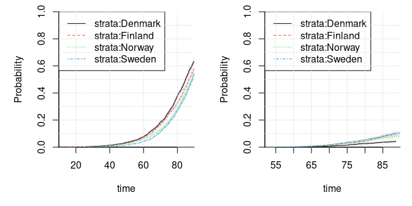

We load and prepare the prostate cancer data set.

``` r
library(mets)
#> Loading required package: timereg
#> Loading required package: survival
#> Loading required package: lava
#> mets version 1.2.9
library(mmcif)

data(prt)
str(prt)
#> 'data.frame':    29222 obs. of  6 variables:
#>  $ country: Factor w/ 4 levels "Denmark","Finland",..: 1 1 1 1 1 1 1 1 1 1 ...
#>  $ time   : num  97 80.9 68 61.5 78.8 ...
#>  $ status : int  1 1 1 1 1 1 1 1 1 2 ...
#>  $ zyg    : Factor w/ 2 levels "DZ","MZ": 1 1 1 1 1 1 2 2 1 1 ...
#>  $ id     : int  1 1 3 3 5 5 9 9 12 12 ...
#>  $ cancer : num  0 0 0 0 0 0 0 0 0 1 ...

with(prt, quantile(time[status > 0], probs = seq(0, 1, by = .1)))
#>       0%      10%      20%      30%      40%      50%      60%      70% 
#>   9.9212  53.6796  62.8195  68.1046  72.4418  76.4447  80.2888  83.9669 
#>      80%      90%     100% 
#>  87.8642  93.0579 117.6224
max_time <- 90
prt <- within(prt, {
  status[time >= max_time] <- 0
  time <- pmin(time, max_time)
})

# use another code for censoring
prt_dz <- subset(prt, zyg == "DZ") |> 
  transform(status = ifelse(status == 0, 3L, status))
prt_mz <- subset(prt, zyg == "MZ") |> 
  transform(status = ifelse(status == 0, 3L, status))

# check distribution of observed events disregarding time
table(prt_dz$status)
#> 
#>     1     2     3 
#>  3916   522 13553
xtabs(~ status + country, prt_dz)
#>       country
#> status Denmark Finland Norway Sweden
#>      1    1303     792    482   1339
#>      2      80     118     69    255
#>      3    4808    1923   1842   4980
prop.table(xtabs(~ status + country, prt_dz), margin = 2L)
#>       country
#> status  Denmark  Finland   Norway   Sweden
#>      1 0.210467 0.279562 0.201421 0.203681
#>      2 0.012922 0.041652 0.028834 0.038789
#>      3 0.776611 0.678786 0.769745 0.757530

table(prt_mz$status)
#> 
#>    1    2    3 
#> 1941  327 8963
xtabs(~ status + country, prt_mz)
#>       country
#> status Denmark Finland Norway Sweden
#>      1     586     308    300    747
#>      2      53      48     47    179
#>      3    2841     737   1367   4018
prop.table(xtabs(~ status + country, prt_mz), margin = 2L)
#>       country
#> status  Denmark  Finland   Norway   Sweden
#>      1 0.168391 0.281793 0.175029 0.151092
#>      2 0.015230 0.043916 0.027421 0.036206
#>      3 0.816379 0.674291 0.797550 0.812702
```

Then we fit separate models for DZ and MZ twins.

``` r
# fits a model given a data set
fit_model <- function(data, res_name){
  res_name <- file.path("cache", res_name)
  
  if(!file.exists(res_name)){
    get_comp_obj <- function(dat = data){
      ghq_data <- fastGHQuad::gaussHermiteData(10) |> 
        with(list(node = x, weight = w))
      
      mmcif_data(
        formula = ~ country - 1, data, cause = status, time = time, 
        cluster_id = id, max_time = max_time, spline_df = 5L, 
        strata = country, ghq_data = ghq_data)
    }
    comp_obj <- get_comp_obj()
    
    start_time <- 
      system.time(start_vals <- mmcif_start_values(comp_obj, n_threads = 4L))
    
    fit_time <- system.time(fit <- mmcif_fit(
      start_vals$upper, object = comp_obj, n_threads = 4L))
    
    ll_start <- mmcif_logLik(
      comp_obj, start_vals$upper, n_threads = 4L, is_log_chol = TRUE)
    
    gr_mle <- mmcif_logLik_grad(
      comp_obj, fit$par, n_threads = 4L, is_log_chol = TRUE)
    
    sandwich_time <- system.time(sandwich_est <- mmcif_sandwich(
      comp_obj, fit$par, n_threads = 4L, order = 0L))
    
    vcov_est <- log_chol_inv(fit$par[comp_obj$indices$vcov_upper])
    vcov_est[lower.tri(vcov_est)] <- NA_real_
    vcov_SE <- matrix(NA_real_, NROW(vcov_est), NCOL(vcov_est))
    vcov_SE[upper.tri(vcov_SE, TRUE)] <- 
      (attr(sandwich_est, "res vcov") |> diag() |> sqrt())[
        comp_obj$indices$vcov_upper]
    
    list(
      fit = fit, start = start_vals, ll_start = ll_start, 
      sandwich_est = sandwich_est, get_comp_obj = get_comp_obj, 
      time = list(start = start_time, fit = fit_time, 
                  sandwich = sandwich_time), 
      vcov_est = vcov_est, vcov_SE = vcov_SE, gr_mle = gr_mle) |> 
      saveRDS(res_name)
  }
  
  readRDS(res_name)
}

# fit models on the two types of twins
fit_dz <- fit_model(prt_dz, "fit_dz.RDS")
fit_mz <- fit_model(prt_mz, "fit_mz.RDS")
```

The results are summarized below.

``` r
# check convergence codes and counts
fit_dz$fit$convergence
#> [1] 0
fit_mz$fit$convergence
#> [1] 0
fit_dz$fit$counts
#> function gradient 
#>      343       92
fit_mz$fit$counts
#> function gradient 
#>      317       81

sqrt(sum(fit_dz$gr_mle^2)) # L2 norm of the gradient at the MLE
#> [1] 0.45267
sqrt(sum(fit_mz$gr_mle^2)) # L2 norm of the gradient at the MLE
#> [1] 0.081017

# the maximum log composite likelihood
print(-fit_dz$fit$value, digits = 10)
#> [1] -23833.41825
print(-fit_mz$fit$value, digits = 10)
#> [1] -12296.74168

# the time to estimate the model and to compute the sandwich estimator
with(fit_dz$time, start + fit + sandwich)
#>    user  system elapsed 
#> 767.594   0.063 192.004
with(fit_mz$time, start + fit + sandwich)
#>    user  system elapsed 
#>  531.88    0.06  133.49

# the parameter estimates along with standard errors
rbind(`DZ estimate` = fit_dz$fit$par,
      `DZ SE` = diag(fit_dz$sandwich_est) |> sqrt(),
      `MZ estimate` = fit_mz$fit$par,
      `MZ SE` = diag(fit_mz$sandwich_est) |> sqrt())
#>             cause1:risk:countryDenmark cause1:risk:countryFinland
#> DZ estimate                   0.724400                    0.63697
#> DZ SE                         0.067749                    0.09077
#> MZ estimate                   0.685783                    0.65964
#> MZ SE                         0.119999                    0.17455
#>             cause1:risk:countryNorway cause1:risk:countrySweden
#> DZ estimate                   0.42549                  0.433040
#> DZ SE                         0.10059                  0.056568
#> MZ estimate                   0.37945                  0.249221
#> MZ SE                         0.15769                  0.092618
#>             cause2:risk:countryDenmark cause2:risk:countryFinland
#> DZ estimate                   -2.48115                   -1.50048
#> DZ SE                          0.19833                    0.18278
#> MZ estimate                   -2.95140                   -2.25141
#> MZ SE                          0.36792                    0.39006
#>             cause2:risk:countryNorway cause2:risk:countrySweden
#> DZ estimate                  -1.90157                  -1.59166
#> DZ SE                         0.20856                   0.14410
#> MZ estimate                  -2.55451                  -2.13919
#> MZ SE                         0.38122                   0.27475
#>             cause1:strataDenmark:spline1 cause1:strataDenmark:spline2
#> DZ estimate                    -1.752470                    -2.342841
#> DZ SE                           0.067474                     0.076842
#> MZ estimate                    -1.829401                    -2.372782
#> MZ SE                           0.107277                     0.118825
#>             cause1:strataDenmark:spline3 cause1:strataDenmark:spline4
#> DZ estimate                    -3.108522                     -4.78941
#> DZ SE                           0.095413                      0.13529
#> MZ estimate                    -3.304490                     -4.80096
#> MZ SE                           0.148451                      0.20275
#>             cause1:strataDenmark:spline5 cause1:strataFinland:spline1
#> DZ estimate                     -3.96622                     -1.93934
#> DZ SE                            0.11935                      0.09892
#> MZ estimate                     -3.87313                     -2.17188
#> MZ SE                            0.16133                      0.16590
#>             cause1:strataFinland:spline2 cause1:strataFinland:spline3
#> DZ estimate                     -2.54312                     -3.11108
#> DZ SE                            0.11063                      0.12057
#> MZ estimate                     -2.71277                     -3.21986
#> MZ SE                            0.18208                      0.20497
#>             cause1:strataFinland:spline4 cause1:strataFinland:spline5
#> DZ estimate                     -5.04416                     -3.98032
#> DZ SE                            0.20842                      0.16400
#> MZ estimate                     -5.45944                     -4.28425
#> MZ SE                            0.33698                      0.20913
#>             cause1:strataNorway:spline1 cause1:strataNorway:spline2
#> DZ estimate                   -1.651777                    -2.25915
#> DZ SE                          0.096486                     0.10532
#> MZ estimate                   -2.057127                    -2.64811
#> MZ SE                          0.156700                     0.17350
#>             cause1:strataNorway:spline3 cause1:strataNorway:spline4
#> DZ estimate                    -2.92728                    -4.67547
#> DZ SE                           0.13303                     0.17485
#> MZ estimate                    -3.32303                    -5.59878
#> MZ SE                           0.19666                     0.32495
#>             cause1:strataNorway:spline5 cause1:strataSweden:spline1
#> DZ estimate                    -3.77842                   -1.923035
#> DZ SE                           0.14634                    0.086307
#> MZ estimate                    -4.58091                   -2.089512
#> MZ SE                           0.23459                    0.131761
#>             cause1:strataSweden:spline2 cause1:strataSweden:spline3
#> DZ estimate                   -2.578540                   -3.203418
#> DZ SE                          0.094924                    0.097343
#> MZ estimate                   -2.810338                   -3.501059
#> MZ SE                          0.145550                    0.148282
#>             cause1:strataSweden:spline4 cause1:strataSweden:spline5
#> DZ estimate                    -5.05430                    -4.02874
#> DZ SE                           0.17214                     0.10758
#> MZ estimate                    -5.38154                    -4.32726
#> MZ SE                           0.26773                     0.16854
#>             cause1:traject:countryDenmark cause1:traject:countryFinland
#> DZ estimate                      2.468093                       2.65846
#> DZ SE                            0.066478                       0.10006
#> MZ estimate                      2.689637                       2.82386
#> MZ SE                            0.106103                       0.16395
#>             cause1:traject:countryNorway cause1:traject:countrySweden
#> DZ estimate                     2.557015                     2.917351
#> DZ SE                           0.089194                     0.089433
#> MZ estimate                     3.089889                     3.171561
#> MZ SE                           0.159637                     0.138606
#>             cause2:strataDenmark:spline1 cause2:strataDenmark:spline2
#> DZ estimate                     -1.99352                     -2.81915
#> DZ SE                            0.26387                      0.31258
#> MZ estimate                     -3.17002                     -3.66146
#> MZ SE                            0.53644                      0.52796
#>             cause2:strataDenmark:spline3 cause2:strataDenmark:spline4
#> DZ estimate                     -3.03195                     -5.47472
#> DZ SE                            0.35537                      0.53575
#> MZ estimate                     -4.40897                     -6.93548
#> MZ SE                            0.66275                      0.85695
#>             cause2:strataDenmark:spline5 cause2:strataFinland:spline1
#> DZ estimate                     -4.15061                     -1.78524
#> DZ SE                            0.42267                      0.22788
#> MZ estimate                     -6.03736                     -2.78402
#> MZ SE                            0.84812                      0.48525
#>             cause2:strataFinland:spline2 cause2:strataFinland:spline3
#> DZ estimate                     -2.02312                     -2.91921
#> DZ SE                            0.23913                      0.33898
#> MZ estimate                     -3.25281                     -4.57041
#> MZ SE                            0.48434                      0.71851
#>             cause2:strataFinland:spline4 cause2:strataFinland:spline5
#> DZ estimate                     -4.78622                     -3.97522
#> DZ SE                            0.45769                      0.39523
#> MZ estimate                     -7.17536                     -4.77733
#> MZ SE                            0.98849                      0.68029
#>             cause2:strataNorway:spline1 cause2:strataNorway:spline2
#> DZ estimate                    -2.23706                    -2.52495
#> DZ SE                           0.29518                     0.29968
#> MZ estimate                    -3.32173                    -3.49378
#> MZ SE                           0.65492                     0.66932
#>             cause2:strataNorway:spline3 cause2:strataNorway:spline4
#> DZ estimate                    -3.37091                     -4.9119
#> DZ SE                           0.38831                      0.4927
#> MZ estimate                    -4.83246                     -7.4172
#> MZ SE                           0.70597                      1.3010
#>             cause2:strataNorway:spline5 cause2:strataSweden:spline1
#> DZ estimate                    -3.83331                    -1.92436
#> DZ SE                           0.41582                     0.18546
#> MZ estimate                    -5.92185                    -2.58319
#> MZ SE                           0.89807                     0.30562
#>             cause2:strataSweden:spline2 cause2:strataSweden:spline3
#> DZ estimate                    -2.50707                    -3.02631
#> DZ SE                           0.21294                     0.26125
#> MZ estimate                    -3.22461                    -3.88183
#> MZ SE                           0.35027                     0.41771
#>             cause2:strataSweden:spline4 cause2:strataSweden:spline5
#> DZ estimate                    -5.03363                    -3.62817
#> DZ SE                           0.41474                     0.30994
#> MZ estimate                    -6.51132                    -4.95142
#> MZ SE                           0.65321                     0.53683
#>             cause2:traject:countryDenmark cause2:traject:countryFinland
#> DZ estimate                       2.85244                       2.68755
#> DZ SE                             0.32044                       0.29463
#> MZ estimate                       4.94330                       4.71807
#> MZ SE                             0.62497                       0.57611
#>             cause2:traject:countryNorway cause2:traject:countrySweden
#> DZ estimate                      2.81038                      2.85184
#> DZ SE                            0.31895                      0.26757
#> MZ estimate                      5.15539                      4.42619
#> MZ SE                            0.72057                      0.45608
#>             vcov:risk1:risk1 vcov:risk1:risk2 vcov:risk2:risk2
#> DZ estimate        -0.358132          0.22573          0.12201
#> DZ SE               0.144184          0.23998          0.12901
#> MZ estimate         0.290440          0.81140          0.70100
#> MZ SE               0.099582          0.34844          0.12710
#>             vcov:risk1:traject1 vcov:risk2:traject1 vcov:traject1:traject1
#> DZ estimate           -0.251830           -0.052896               -0.95584
#> DZ SE                  0.087342            0.092795                0.23075
#> MZ estimate           -0.333877           -0.033831               -0.70002
#> MZ SE                  0.097251            0.119333                0.19590
#>             vcov:risk1:traject2 vcov:risk2:traject2 vcov:traject1:traject2
#> DZ estimate            -0.27244            -0.35688              -0.241838
#> DZ SE                   0.12924             0.15425               0.214553
#> MZ estimate            -0.22806            -0.92362              -0.082922
#> MZ SE                   0.33122             0.24957               0.507877
#>             vcov:traject2:traject2
#> DZ estimate              -12.91176
#> DZ SE                    469.90422
#> MZ estimate               -0.18234
#> MZ SE                      0.36803

# the estimated covariance matrices along with standard errors
fit_dz$vcov_est # the estimates for DZ
#>         [,1]    [,2]     [,3]       [,4]
#> [1,] 0.48857 0.15778 -0.17602 -0.1904275
#> [2,]      NA 1.32734 -0.11661 -0.4646929
#> [3,]      NA      NA  0.21405 -0.0054996
#> [4,]      NA      NA       NA  0.2600719
fit_dz$vcov_SE # the SEs
#>         [,1]    [,2]     [,3]     [,4]
#> [1,] 0.14089 0.17266 0.055817 0.094265
#> [2,]      NA 0.33726 0.099333 0.174409
#> [3,]      NA      NA 0.047439 0.080576
#> [4,]      NA      NA       NA 0.187550
fit_mz$vcov_est # the estimates for MZ
#>        [,1]   [,2]     [,3]      [,4]
#> [1,] 1.7876 1.0849 -0.44640 -0.304923
#> [2,]     NA 4.7217 -0.33910 -2.046850
#> [3,]     NA     NA  0.35921  0.066215
#> [4,]     NA     NA       NA  1.606376
fit_mz$vcov_SE # the SEs
#>         [,1]    [,2]     [,3]    [,4]
#> [1,] 0.35603 0.50366 0.123468 0.44242
#> [2,]      NA 1.22342 0.237454 0.59387
#> [3,]      NA      NA 0.076287 0.19321
#> [4,]      NA      NA       NA 0.50954
```

``` r
# plot the conditional cumulative incidence functions
plot_curves <- function(fit){
  comp_obj <- fit$get_comp_obj()
  
  # get the estimates
  n_causes <- 2L
  coef_risk_est <- fit$fit$par[comp_obj$indices$coef_risk] |> 
    matrix(ncol = n_causes)
  coef_traject_time_est <- fit$fit$par[comp_obj$indices$coef_trajectory_time] |> 
    matrix(ncol = n_causes)
  coef_traject_est <- fit$fit$par[comp_obj$indices$coef_trajectory] |> 
    matrix(ncol = n_causes)
  
  # plot the estimated cumulative incidence functions
  par(mar = c(5, 5, 1, 1), mfcol = c(1, 2))
  for(i in 1:2){
    pts <- seq(min(prt$time), max_time * (1 - 1e-8), length.out = 1000)
    curves <- sapply(1:4 - 1L, \(strata){
      # compute the risk probabilities  
      probs_est <- exp(coef_risk_est[1 + strata, ]) / 
        (1 + sum(exp(coef_risk_est[1 + strata, ])))
      
      probs_est[i] * pnorm(
        -comp_obj$time_expansion(pts, cause = i, which_strata = strata + 1L) %*% 
          coef_traject_time_est[, i] - 
          coef_traject_est[21 + strata, i]) |> drop()
    })
    
    matplot(
      pts, curves, ylim = c(0, 1), bty = "l",  xlab = "time", type = "l",
      ylab = sprintf("Cumulative incidence; cause %d", i), lty = 1:4, 
      col = "black", yaxs = "i", xaxs = "i")
    grid(ny = 10)
    legend("topleft", legend = levels(prt$country), bty = "n", 
           cex = par("cex") * .8, lty = 1:4)
  }
}

plot_curves(fit_dz)
```


``` r
plot_curves(fit_mz)
```


``` r
# compare to marginal estimates (NOT directly comparable; the above are 
# conditional)
par(mar = c(5, 5, 1, 1))
plot_cif <- \(data, cause){
  cif(Event(time, status) ~ strata(country), data = data,
              cause = cause, cens.code = 3) |>
    bplot(se = TRUE, ylim = c(0, 1), bty = "l", yaxs = "i", xaxs = "i")
  grid(ny = 10)
}

plot_cif(prt_dz, 1)
plot_cif(prt_dz, 2)
```



``` r
plot_cif(prt_mz, 1)
plot_cif(prt_mz, 2)
```


