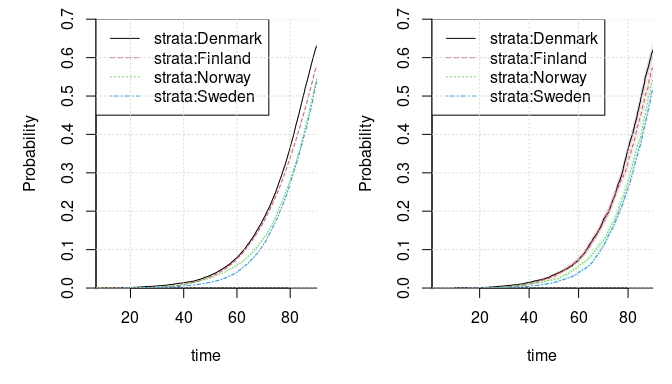
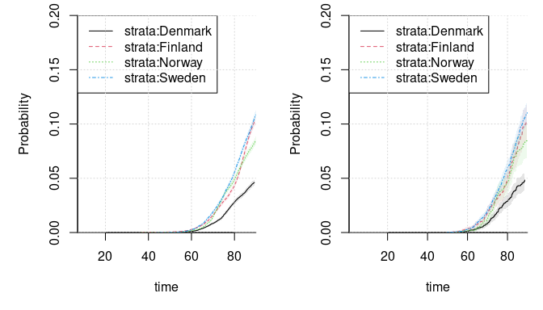
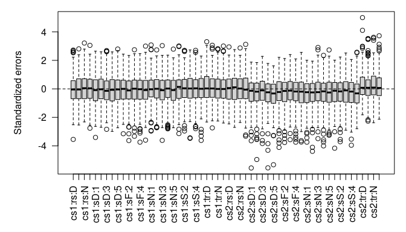

## Setup

In this example, we simulate from the estimated model fitted to the DZ
twins from the prt data set in the mets package. We start by assigning
the model parameters.

``` r
n_causes <- 2L
delta <- 90 # maximum follow up 

# the random effect covariance matrix
rng_vcov <- 
  c(0.4908, 0.1642, -0.175, -0.1981, 0.1642, 1.3268, -0.1143, -0.4673, -0.175, -0.1143, 0.2147, -0.0068, -0.1981, -0.4673, -0.0068, 0.2731) |>
  matrix(n_causes * n_causes)
rng_vcov
#>         [,1]    [,2]    [,3]    [,4]
#> [1,]  0.4908  0.1642 -0.1750 -0.1981
#> [2,]  0.1642  1.3268 -0.1143 -0.4673
#> [3,] -0.1750 -0.1143  0.2147 -0.0068
#> [4,] -0.1981 -0.4673 -0.0068  0.2731
cov2cor(rng_vcov)
#>         [,1]    [,2]     [,3]     [,4]
#> [1,]  1.0000  0.2035 -0.53910 -0.54109
#> [2,]  0.2035  1.0000 -0.21415 -0.77630
#> [3,] -0.5391 -0.2142  1.00000 -0.02808
#> [4,] -0.5411 -0.7763 -0.02808  1.00000

# the fixed effects
fixef_use <- c(
  `cause1:risk:countryDenmark` = 0.7248, `cause1:risk:countryFinland` = 0.6377, 
  `cause1:risk:countryNorway` = 0.4263, `cause1:risk:countrySweden` = 0.4337, 
  `cause2:risk:countryDenmark` = -2.4775, `cause2:risk:countryFinland` = -1.4976, 
  `cause2:risk:countryNorway` = -1.8983, `cause2:risk:countrySweden` = -1.5889, 
  `cause1:strataDenmark:spline1` = -1.7531, `cause1:strataDenmark:spline2` = -2.3436, 
  `cause1:strataDenmark:spline3` = -3.1094, `cause1:strataDenmark:spline4` = -4.791, 
  `cause1:strataDenmark:spline5` = -3.9674, `cause1:strataFinland:spline1` = -1.94, 
  `cause1:strataFinland:spline2` = -2.5439, `cause1:strataFinland:spline3` = -3.1119, 
  `cause1:strataFinland:spline4` = -5.0457, `cause1:strataFinland:spline5` = -3.9813, 
  `cause1:strataNorway:spline1` = -1.6525, `cause1:strataNorway:spline2` = -2.26, 
  `cause1:strataNorway:spline3` = -2.9281, `cause1:strataNorway:spline4` = -4.6772, 
  `cause1:strataNorway:spline5` = -3.7794, `cause1:strataSweden:spline1` = -1.9238, 
  `cause1:strataSweden:spline2` = -2.5794, `cause1:strataSweden:spline3` = -3.2045, 
  `cause1:strataSweden:spline4` = -5.0561, `cause1:strataSweden:spline5` = -4.0299, 
  `cause1:traject:countryDenmark` = 2.4684, `cause1:traject:countryFinland` = 2.659, 
  `cause1:traject:countryNorway` = 2.5576, `cause1:traject:countrySweden` = 2.9181, 
  `cause2:strataDenmark:spline1` = -2.0057, `cause2:strataDenmark:spline2` = -2.8358, 
  `cause2:strataDenmark:spline3` = -3.0488, `cause2:strataDenmark:spline4` = -5.5071, 
  `cause2:strataDenmark:spline5` = -4.1739, `cause2:strataFinland:spline1` = -1.795, 
  `cause2:strataFinland:spline2` = -2.0336, `cause2:strataFinland:spline3` = -2.936, 
  `cause2:strataFinland:spline4` = -4.8131, `cause2:strataFinland:spline5` = -3.9967, 
  `cause2:strataNorway:spline1` = -2.2498, `cause2:strataNorway:spline2` = -2.5397, 
  `cause2:strataNorway:spline3` = -3.3897, `cause2:strataNorway:spline4` = -4.9405, 
  `cause2:strataNorway:spline5` = -3.8549, `cause2:strataSweden:spline1` = -1.9365, 
  `cause2:strataSweden:spline2` = -2.5222, `cause2:strataSweden:spline3` = -3.0444, 
  `cause2:strataSweden:spline4` = -5.0647, `cause2:strataSweden:spline5` = -3.6486, 
  `cause2:traject:countryDenmark` = 2.8649, `cause2:traject:countryFinland` = 2.6987, 
  `cause2:traject:countryNorway` = 2.8229, `cause2:traject:countrySweden` = 2.8657)

# split the coefficients
countries <- c("Denmark", "Finland", "Norway", "Sweden")
country_indices <- setNames(countries, countries) |> 
  lapply(grepl, names(fixef_use)) |> lapply(which)

# the knots for the splines
knots <- list(
  `1` = list(
    knots = c(`21.5%` = 0.3496, `40.5%` = 0.6007, `59.5%` = 0.8536, `78.5%` = 1.2062), 
    boundary_knots = c(`2.5%` = -0.2174, `97.5%` = 2.2291)), 
  `2` = list(
    knots = c(`21.5%` = 0.5769, `40.5%` = 0.7479, `59.5%` = 0.9623, `78.5%` = 1.259), 
    boundary_knots = c(`2.5%` = 0.2772, `97.5%` = 2.0689)))
```

A function is then assigned to simulate a data set with a given number
of families of a given maximum size. The families are taken to be
siblings rather than DZ twins. We do this to test the code for the
composite likelihood.

``` r
library(mvtnorm)
library(splines)
library(SimSurvNMarker)
sim_dat <- \(n_clusters, max_cluster_size){
  stopifnot(max_cluster_size > 0,
            n_clusters > 0)
  
  cluster_id <- 0L
  apply(rmvnorm(n_clusters, sigma = rng_vcov), 1, \(rng_effects){
    U <- head(rng_effects, n_causes)
    eta <- tail(rng_effects, n_causes)
    
    n_obs <- sample.int(max_cluster_size, 1L)
    cluster_id <<- cluster_id + 1L
    
    # draw the cause
    country <- sample(countries, 1L)
    country_coefs <- fixef_use[country_indices[[country]]]
    Z <- matrix(1., n_obs, 1)
    coef_risk <- head(country_coefs, 2) |> matrix(ncol = 2)
    country_coefs <- country_coefs[-(1:2)]
  
    cond_logits_exp <- exp(Z %*% coef_risk + rep(U, each = n_obs)) |> 
      cbind(1)
    cond_probs <- cond_logits_exp / rowSums(cond_logits_exp)
    cause <- apply(cond_probs, 1, 
                   \(prob) sample.int(n_causes + 1L, 1L, prob = prob))
    
    # compute the observed time if needed
    coef_traject <- matrix(country_coefs, ncol = 2)
    
    obs_time <- mapply(\(cause, idx){
      if(cause > n_causes)
        return(delta)
      
      # can likely be done smarter but this is more general
      coefs <- coef_traject[, cause]
      n_coefs <- length(coefs)
      offset <- Z[idx, ] * coefs[n_coefs] + eta[cause]
      rng <- runif(1)
      eps <- .Machine$double.eps
      
      knots <- sort(c(
        knots[[cause]]$knots, knots[[cause]]$boundary_knots))
      ns_func <- get_ns_spline(knots = knots, intercept = FALSE, do_log = FALSE)
      
      root <- uniroot(
        \(x) rng - pnorm(
          -ns_func(atanh((x - delta / 2) / (delta / 2))) %*% coefs[-n_coefs] - 
            offset), 
        c(delta * eps, delta * (1 - eps)), tol = 1e-12)$root
    }, cause, 1:n_obs)
    
    cens <- runif(n_obs, 70, max = 140)
    has_finite_trajectory_prob <- cause <= n_causes
    is_censored <- which(!has_finite_trajectory_prob | cens < obs_time)
    
    if(length(is_censored) > 0){
      obs_time[is_censored] <- pmin(delta, cens[is_censored])
      cause[is_censored] <- n_causes + 1L
    }
    
    data.frame(country = factor(country,levels = countries), 
               cause, time = obs_time, cluster_id)
  }, simplify = FALSE) |> 
    do.call(what = rbind)
}
```

The censoring distribution is deliberately different from that in the
prt data set. Above, we sample a censoring time from the uniform
distribution on 70 to 140 and use a maximum follow up for `delta` (90).

### Big Example

We simulate one very big sample as an example below. We use it to check
the marginal cumulative incidence functions.

``` r
set.seed(1)
dat <- sim_dat(40000L, 4L)

# compare the cumulative incidence functions
library(mets)
data(prt)
plot_cif <- \(data, cause, cens.code, ylim){
  cif(Event(time, status) ~ strata(country), data = data,
              cause = cause, cens.code = cens.code) |>
    bplot(se = TRUE, ylim = ylim, bty = "l", yaxs = "i", xaxs = "i",
          xlim = range(data$time, delta))
  grid()
}
par(mar = c(5, 5, 1, 1), mfcol = c(1, 2))
transform(dat, status = cause) |> 
  plot_cif(1, 3, c(0, .7))
transform(prt, status = ifelse(time > delta, 0, status), 
          time = pmin(time, delta)) |> 
  plot_cif(1, 0, c(0, .7))
```



``` r
transform(dat, status = cause) |> 
  plot_cif(2, 3, c(0, .2))
transform(prt, status = ifelse(time > delta, 0, status), 
          time = pmin(time, delta)) |> 
  plot_cif(2, 0, c(0, .2))
```



``` r
# distribution of cause and censoring by country
xtabs(~ cause + country, dat)
#>      country
#> cause Denmark Finland Norway Sweden
#>     1   14117   12645  11861  11664
#>     2    1027    2169   1875   2353
#>     3   10109    9806  11246  10932

# compare with the real data
xtabs(~ status + country, prt, zyg == "DZ")
#>       country
#> status Denmark Finland Norway Sweden
#>      0    4580    1832   1775   4587
#>      1    1519     871    542   1702
#>      2      92     130     76    285

rm(dat)
```

## Run Simulations

The simulation study is run below.

``` r
# the seeds we will use
seeds <- c(
  3801443L, 5075715L, 90654298L, 69953569L, 24145488L, 37395236L, 3397298L, 29556452L, 11902732L, 83659145L, 79020848L, 6873483L, 52104313L, 82575228L, 39854843L, 27659320L, 21545556L, 99303315L, 30514827L, 97314625L, 66681319L, 7554587L, 10601023L, 98955744L, 7973414L, 27137806L, 97086805L, 10849812L, 56811865L, 40591357L, 27622323L, 20704367L, 26129989L, 59664086L, 20394834L, 31041096L, 69241317L, 98143755L, 69747552L, 95522767L, 20988881L, 92765370L, 92007002L, 38995781L, 61844563L, 37767715L, 6892297L, 44823300L, 90427433L, 16652226L, 19238582L, 18868020L, 45371242L, 34896848L, 3147855L, 19145988L, 6956189L, 26394416L, 90119619L, 70061324L, 34856298L, 6480659L, 470084L, 99164168L, 54598713L, 56242522L, 946619L, 71842730L, 78916610L, 43197670L, 40785255L, 68430049L, 7316996L, 88007217L, 97779949L, 18204348L, 42580794L, 48043274L, 49422563L, 23384843L, 48119653L, 40024064L, 82241542L, 23945157L, 7348966L, 31308406L, 50655843L, 5511073L, 86409696L, 17254829L, 86625590L, 39016554L, 254960L, 72325897L, 81907993L, 43767460L, 9813746L, 67163411L, 34771638L, 14458784L,
  6107389L, 99222470L, 74541671L, 4427521L, 31324739L, 87909863L, 5363954L, 7972436L, 89091551L, 82522565L, 38322145L, 80853692L, 4635947L, 14226266L, 57255540L, 47917984L, 15134599L, 41074789L, 34747341L, 37713337L, 73576213L, 22896151L, 19294728L, 11903703L, 81652663L, 65628379L, 7759554L, 38085849L, 77988326L, 2711476L, 42699072L, 13939535L, 13309636L, 40783840L, 66953812L, 44937860L, 56848683L, 38494023L, 34446891L, 56212562L, 12159007L, 78524592L, 77158965L, 60902768L, 26391744L, 20759428L, 5142151L, 49822423L, 34755341L, 2343101L, 89647424L, 54335676L, 53949934L, 25553437L, 95464965L, 33724618L, 44759763L, 43170713L, 21473251L, 95385587L, 73469462L, 75583390L, 62325031L, 36708220L, 74462145L, 1531695L, 97162075L, 2238573L, 93241786L, 86012090L, 32512791L, 98512628L, 10785328L, 69070455L, 65335558L, 79956047L, 79786019L, 75611428L, 43037890L, 77173274L, 80088784L, 98780063L, 22158404L, 26285879L, 20173650L, 93837891L, 79077674L, 99777953L, 45511660L, 34988180L, 26270083L, 41748471L, 78623133L, 9851304L, 70926906L, 97440067L, 44231504L, 65209848L, 32477966L, 35286669L,
  18612880L, 75158978L, 24945044L, 83128915L, 12422305L, 76310401L, 96911366L, 24836498L, 24390614L, 47805304L, 48798547L, 12801456L, 28338722L, 22176621L, 30278043L, 68233057L, 52273206L, 86526863L, 64350206L, 52093957L, 61471870L, 41651208L, 41179957L, 60068169L, 51497552L, 22762841L, 81656534L, 31158389L, 56580439L, 96912971L, 6555878L, 28828203L, 68602177L, 66386801L, 26870516L, 66175055L, 56898305L, 25152489L, 15088101L, 76363313L, 57811523L, 23194661L, 56627634L, 5085932L, 69771046L, 28971027L, 99985241L, 89781247L, 46215360L, 78596105L, 28037431L, 23334254L, 60129591L, 54857626L, 34779583L, 87318869L, 92543979L, 4258411L, 11741323L, 9736304L, 1105185L, 3889258L, 80513224L, 23477889L, 66925771L, 5908957L, 86116672L, 24714502L, 23917962L, 34271842L, 22849618L, 70096844L, 49411557L, 59852608L, 389877L, 1858501L, 18890179L, 52717398L, 23675950L, 52136511L, 71688163L, 10775075L, 74797137L, 6177792L, 39137897L, 47181219L, 25066264L, 44294609L, 99906466L, 64652899L, 82925731L, 56146323L, 9806843L, 80762335L, 3827387L, 39657827L, 15506997L, 3490081L, 35652802L, 9820523L,
  62616043L, 20475253L, 89064395L, 13130003L, 95488873L, 7238038L, 18075730L, 44587103L, 45828578L, 51575539L, 76451839L, 8106703L, 1113945L, 52633558L, 14690401L, 40999412L, 43933435L, 65061607L, 47877981L, 23224074L, 78474160L, 62745187L, 25589650L, 13786756L, 34117568L, 4438216L, 2700155L, 38502728L, 76521927L, 96933209L, 81528891L, 36765812L, 4996397L, 82540687L, 6875573L, 17036587L, 42214037L, 77928212L, 13534602L, 56877525L, 79043614L, 99580396L, 87620545L, 55317489L, 20012714L, 63463965L, 62766573L, 55964135L, 87799889L, 15461970L, 21984948L, 64938455L, 12652112L, 70415954L, 2514074L, 47475316L, 47172210L, 18729706L, 78681351L, 79166766L, 97542763L, 2368997L, 55450348L, 38062414L, 15472283L, 19926953L, 89823491L, 67177945L, 49552682L, 49983278L, 58641302L, 7184941L, 37496327L, 91996546L, 19075493L, 78971421L, 96072442L, 53971762L, 62161727L, 2185452L, 15569204L, 37550407L, 95037413L, 41337970L, 22712614L, 69950897L, 75645089L, 89536138L, 85532353L, 40760984L, 60196849L, 76536101L, 76082706L, 5551998L, 31970436L, 17847791L, 13812134L, 55355922L, 8505085L, 63220064L,
  61234474L, 30200168L, 84240136L, 68321585L, 33575055L, 21116116L, 88980361L, 2516517L, 69906784L, 37680684L, 43736077L, 48331115L, 79355597L, 33417522L, 40649828L, 45982578L, 60617935L, 32401420L, 61313453L, 1572539L, 54808234L, 57999496L, 40116922L, 49060893L, 74565980L, 93464330L, 22122463L, 47585667L, 13861801L, 22985672L, 56076498L, 73527537L, 28054349L, 83563265L, 55466361L, 86430609L, 88361652L, 69479444L, 53712907L, 43906456L, 35111767L, 86127804L, 75942093L, 21522330L, 80897555L, 80555880L, 43218655L, 52260220L, 464593L, 81458721L, 7060488L, 84286414L, 27856056L, 10447187L, 43325654L, 40167013L, 98137483L, 32965627L, 84111108L, 24301678L, 26067151L, 36734543L, 75518576L, 79633405L, 81220969L, 12444910L, 48800038L, 57180080L, 4063371L, 26788765L, 59073945L, 56747185L, 27425910L, 48027993L, 88613419L, 33435531L, 95782106L, 11272047L, 7990797L, 45876196L, 20671861L, 62040606L, 204277L, 59878704L, 8066223L, 63102811L, 61937910L, 49962187L, 5463598L, 63090128L, 91444829L, 51681529L, 47692226L, 93172334L, 39929967L, 40063903L, 58806613L, 4506225L, 9098662L, 61421212L,
  39836029L, 91922701L, 25658659L, 89651740L, 85299171L, 1329487L, 54514576L, 84973569L, 8901869L, 38952372L, 38964348L, 59615517L, 39230306L, 92336850L, 55506486L, 73024849L, 7011440L, 57475802L, 25357386L, 34815592L, 49702338L, 59461428L, 10468906L, 63896687L, 11453245L, 22855763L, 12822184L, 80649178L, 31440252L, 85692415L, 55113925L, 2938089L, 62170569L, 71808096L, 14272639L, 75434596L, 22090797L, 26095941L, 48190909L, 5420440L, 62433837L, 91995360L, 32161100L, 51499042L, 21753325L, 11573205L, 62917496L, 38844830L, 10597660L, 28691232L, 45193046L, 69504445L, 58095011L, 87294769L, 98899794L, 7948320L, 65628845L, 84993125L, 14337526L, 70225771L, 45659451L, 48008366L, 29494192L, 92610860L, 61883958L, 38323024L, 12756309L, 20747297L, 60755526L, 32258141L, 59829257L, 43091311L, 62866717L, 57283975L, 13646889L, 97325006L, 26680820L, 36795322L, 12217068L, 52175104L, 43457304L, 81139664L, 80364158L, 33341271L, 31610679L, 65586442L, 21885124L, 54563233L, 76375541L, 72484121L, 53619798L, 44242065L, 55640933L, 84880344L, 13618246L, 41270444L, 46050500L, 22141537L, 47964010L, 28046584L,
  83092261L, 20290303L, 92511623L, 4235814L, 46503168L, 58993765L, 62175378L, 57722403L, 35442388L, 41407680L, 51033462L, 1269772L, 41650305L, 20790426L, 71540937L, 56135805L, 15250307L, 88593235L, 28044464L, 28271725L, 92888299L, 36700742L, 69752062L, 99110254L, 46417047L, 55285597L, 54697905L, 91904868L, 97933733L, 12630412L, 46838691L, 726245L, 43175934L, 58627144L, 69057198L, 41712378L, 32876384L, 5913184L, 21164248L, 84593196L, 4916581L, 86141165L, 37548356L, 89972651L, 92857944L, 84434380L, 74882512L, 6053420L, 88322037L, 2271826L, 77937445L, 34179301L, 1627810L, 89883487L, 52512335L, 26163799L, 1606212L, 26192443L, 67733426L, 86885799L, 74417774L, 46166858L, 95503206L, 90538745L, 54006634L, 80511938L, 35732538L, 16689596L, 31976218L, 9473644L, 49767944L, 2908602L, 92249609L, 20855716L, 6393681L, 57123668L, 17211911L, 47111829L, 4053791L, 74051625L, 59391179L, 41840999L, 54783904L, 13002111L, 73826458L, 96683355L, 76446156L, 23013953L, 11985286L, 19300289L, 46175080L, 41683768L, 56739472L, 5410874L, 57528197L, 54215130L, 96490116L, 26025074L, 6884000L, 10573547L,
  20787201L, 30367152L, 75536710L, 68551423L, 8665297L, 91781144L, 80348201L, 22060772L, 40765203L, 40766134L, 13992389L, 35981917L, 30865917L, 30731345L, 55100790L, 36990304L, 70989289L, 47244669L, 39876055L, 27305114L, 76973517L, 22752098L, 61468441L, 80758524L, 13099548L, 11680836L, 63920731L, 47693384L, 82384941L, 62793409L, 37013092L, 96716531L, 26498684L, 1162412L, 29994025L, 94469373L, 50783806L, 32986659L, 70293143L, 38790113L, 72981559L, 25786532L, 60153699L, 44155527L, 66395941L, 91034886L, 39444285L, 26550722L, 99472137L, 37588010L, 14970462L, 84238442L, 18800267L, 77098635L, 15507875L, 71754511L, 40135748L, 7632798L, 51769683L, 46634356L, 97619400L, 99633704L, 71452716L, 11289578L, 65112392L, 1202104L, 28293157L, 51109736L, 21550928L, 17997165L, 43905869L, 8644433L, 39643940L, 72722404L, 56905337L, 49866604L, 30194987L, 26967720L, 75740552L, 48149225L, 96438500L, 51480213L, 64019784L, 47550674L, 7868588L, 20642195L, 82056435L, 86189871L, 76903409L, 85513353L, 40624355L, 57218131L, 90881719L, 88982246L, 6907566L, 49494285L, 2178330L, 11535786L, 24707388L, 20759569L,
  30904032L, 19714495L, 98914091L, 14286683L, 34246919L, 53454221L, 29909767L, 76107852L, 98287495L, 31848418L, 97332259L, 90237542L, 90407513L, 36601675L, 61379373L, 14962579L, 85751855L, 51097600L, 4579658L, 35037827L, 65983268L, 95664338L, 64445293L, 92847320L, 36427756L, 94972167L, 48536641L, 34634792L, 93686906L, 75625134L, 54411521L, 99683827L, 98285194L, 50851692L, 53173589L, 54339157L, 85982326L, 49578776L, 19055596L, 17845714L, 58172223L, 87776266L, 82451837L, 30963812L, 96550150L, 16789675L, 72405623L, 73280738L, 17882245L, 53674826L, 58421140L, 17657080L, 56357029L, 97279465L, 76339423L, 38655861L, 47795476L, 24127591L, 17003141L, 31529280L, 44795973L, 57192219L, 77011411L, 77082301L, 66809391L, 73628782L, 80618785L, 60290896L, 98816410L, 78459249L, 51015747L, 9339438L, 7735653L, 55137964L, 2649782L, 32094862L, 11054537L, 55026725L, 36501345L, 37160307L, 95290669L, 78105354L, 61896597L, 90529291L, 62058339L, 82587737L, 86434308L, 11314106L, 65585680L, 44631521L, 66707823L, 36945987L, 62771270L, 56041216L, 49407463L, 35064480L, 82935524L, 82926618L, 99011220L, 66551356L,
  57734420L, 87705847L, 68700642L, 94998529L, 40638205L, 17472862L, 9623244L, 41911377L, 90727630L, 20192974L, 51911714L, 72037717L, 29055347L, 79084121L, 42690442L, 57658800L, 32406854L, 11827378L, 71434903L, 6520224L, 40378081L, 82454413L, 49848684L, 99156729L, 43200689L, 45825970L, 56813057L, 66668227L, 15410386L, 45786940L, 11577290L, 96659464L, 27838101L, 89447174L, 94661063L, 43143144L, 92436466L, 28795868L, 88719708L, 58012414L, 83663820L, 92536227L, 6478836L, 75961355L, 93750181L, 40809923L, 40248631L, 24026365L, 76747845L, 39579657L, 22304528L, 25408144L, 98475143L, 91338826L, 9659112L, 9676169L, 97647129L, 75995932L, 21077602L, 14599886L, 14063561L, 87754142L, 49651428L, 93579175L, 16856482L, 62909222L, 28203791L, 82130229L, 10563540L, 29795807L, 74012489L, 51608268L, 36025923L, 49002154L, 44820329L, 32215766L, 37729563L, 46243684L, 93235654L, 70479327L, 48931268L, 75147153L, 18645143L, 63509016L, 19247702L, 88851527L, 38252804L, 8409059L, 29640815L, 48907451L, 29317158L, 37326621L, 29213441L, 81371490L, 7635543L, 29283495L, 37070578L, 36994816L, 19320871L, 75198921L)
seeds <- head(seeds, 300)

# configuration of the number of clusters, maximum family size and the number 
# of quadrature nodes
n_clusters <- 16000L
max_cluster_size <- 4L
n_quad_nodes_small <- 3L
n_quad_nodes_large <- 8L

# run the simulation study
library(mmcif)
sim_res <- lapply(seeds, \(s){
  res_file <- file.path(
    "cache", "prostate-dz-sims", sprintf(
      "%d-%d-%d-%d-%d.RDS", n_clusters, max_cluster_size, n_quad_nodes_small, 
      n_quad_nodes_large, s))
  
  if(!file.exists(res_file)){
    set.seed(s)
    data <- sim_dat(n_clusters, max_cluster_size)
    
    ghq_list <- lapply(
      c(n_quad_nodes_small, n_quad_nodes_large), 
      \(n_nodes) 
        fastGHQuad::gaussHermiteData(n_nodes) |> 
          with(list(node = x, weight = w)))
    
    fit_obj <- mmcif_data(
      ~ country - 1, data, cause = cause, time = time, cluster_id = cluster_id,
      max_time = delta, knots = knots, strata = country, 
      ghq_data = ghq_list[[length(ghq_list)]])
    
    fit_time <- system.time({
      start <- mmcif_start_values(fit_obj, n_threads = 4L)
      fits <- mmcif_fit(
        start$upper, fit_obj, n_threads = 4L, ghq_data = ghq_list)
      fit <- fits[[length(fits)]]
      sandwich <- mmcif_sandwich(fit_obj, fit$par, n_threads = 4L, order = 1L)
    })
    
    gr_max <- mmcif_logLik_grad(
      fit_obj, fit$par, n_threads = 4L, is_log_chol = TRUE)
    # num_gr <- numDeriv::grad(
    #   mmcif_logLik, fit$par, method.args = list(r = 2), object = fit_obj,
    #   n_threads = 4L, is_log_chol = TRUE)
    
    n_binding <- sum(fit_obj$constraints$vcov_upper %*% fit$par < 1e-5)
    
    list(
      start = start, fit = fit, fits = fits, sandwich = sandwich, 
      gr_max = gr_max, time = fit_time, 
      vcov = tail(fit$par, 10) |> log_chol_inv(), 
      fixef = head(fit$par, -10), n_binding = n_binding, 
      constraints = fit_obj$constraints) |> 
      saveRDS(res_file)
  }
  
  out <- readRDS(res_file)
  sprintf("\n\nMax composite log likelihood, gradient norm and computation time (seconds): %.4f %.4f %.2f",
          -out$fit$value, sum(out$gr_max^2) |> sqrt(), out$time["elapsed"]) |> 
    message()
  
  print_message <- \(x)
    capture.output(print(x, na.print = "")) |> paste0(collapse = "\n") |> 
      message()
  message("\nFunction/gradients counts")
  lapply(out$fits, `[[`, "counts") |> 
    do.call(what = rbind) |> print_message()
  
  remove_lower <- \(x){
    x[lower.tri(x)] <- NA
    x
  }

  message("\nEstimated fixed effects and  Z stats")
  SEs <- attr(out$sandwich, "res vcov") |> diag() |> sqrt()
  tab_fixef <- rbind(
    Estimates = out$fixef, 
    `Z stats` = c(out$fixef - fixef_use) / head(SEs, length(fixef_use)))
  colnames(tab_fixef) <- colnames(tab_fixef) |> abbreviate(minlength = 8)
  print_message(tab_fixef)
  
  stopifnot(all(names(out$fixef) == names(fixef_use)))
  out$tab_fixef <- tab_fixef
  
  message("\nEstimated covariance matrix followed by SEs and Z stats")
  
  SEs_mat <- matrix(NA, 4, 4)
  SEs_mat[upper.tri(SEs_mat, TRUE)] <- 
    tail(SEs, upper.tri(SEs_mat, TRUE) |> sum())
  err_mat <- (out$vcov - rng_vcov) / SEs_mat
  
  print_message(cbind(remove_lower(out$vcov), NA, SEs_mat, NA, err_mat))
  out$vcov_err_mat <- err_mat
  
  out
})
```

## Simulation Results

We show other metrics such as the statistics for the computation time
and the number times that a boundary solution was found below.

``` r
# statistics for the estimation time
sapply(sim_res, \(x) x$time["elapsed"]) |> 
  (\(x) 
   c(Mean = mean(x), SD = sd(x), 
     quantile(x, probs = seq(0, 1, length.out = 11))))()
#>    Mean      SD      0%     10%     20%     30%     40%     50%     60%     70% 
#>   294.5   204.1 -3193.5   270.7   281.0   291.1   299.7   306.8   312.6   317.4 
#>     80%     90%    100% 
#>   325.5   332.8   440.7

# check convergence code
sapply(sim_res, \(x) x$fit$convergence) |> table()
#> 
#>   1 
#> 300

# distribution of the gradient norm at the MLEs
gradient_norms <- sapply(sim_res, \(x) sqrt(sum(x$gr_max^2)))
quantile(gradient_norms, probs = seq(0, 1, length.out = 21))
#>      0%      5%     10%     15%     20%     25%     30%     35%     40%     45% 
#> 0.01258 0.02606 0.03516 0.04269 0.05063 0.05908 0.06417 0.07598 0.08299 0.08979 
#>     50%     55%     60%     65%     70%     75%     80%     85%     90%     95% 
#> 0.10051 0.10983 0.11773 0.13864 0.15365 0.17433 0.19077 0.22952 0.26440 0.32123 
#>    100% 
#> 0.89081

# distribution of the number of binding constraints
n_binding <- sapply(sim_res, \(x) x$n_binding)
table(n_binding)
#> n_binding
#>   0 
#> 300

# statistics for the gradient norm by the number of binding constraints
tapply(gradient_norms, n_binding, summary) |> 
  do.call(what = rbind)
#>      Min. 1st Qu. Median   Mean 3rd Qu.   Max.
#> 0 0.01258 0.05908 0.1005 0.1299  0.1743 0.8908
```

The bias estimates for the fixed effects and the random effect
covariance matrix are shown below.

``` r
# we start with the random effect covariance matrix
print_sym_mat <- \(x){
  x[lower.tri(x)] <- NA
  print(x, na.print = "")
}

vcov_est <- sapply(sim_res, `[[`, "vcov", simplify = "array")

# the true values and the bias estimates for the covariance matrix
vcov_bias <- apply(vcov_est - c(rng_vcov), 1:2, mean)
print_sym_mat(rng_vcov) # true values
#>        [,1]   [,2]    [,3]    [,4]
#> [1,] 0.4908 0.1642 -0.1750 -0.1981
#> [2,]        1.3268 -0.1143 -0.4673
#> [3,]                0.2147 -0.0068
#> [4,]                        0.2731
print_sym_mat(vcov_bias) # bias estimates
#>          [,1]    [,2]       [,3]     [,4]
#> [1,] 0.003939 0.01479  0.0007576 0.009320
#> [2,]          0.01802  0.0012298 0.016074
#> [3,]                  -0.0002843 0.001102
#> [4,]                             0.016048
# the standard errors of the Z stats
print_sym_mat(
  vcov_bias / (apply(vcov_est, 1:2, sd) / sqrt(dim(vcov_est)[3]))) # Z stats
#>      [,1]  [,2]    [,3]   [,4]
#> [1,] 1.55 4.430  0.7868 4.0291
#> [2,]      2.372  0.6104 4.0353
#> [3,]            -0.3245 0.7956
#> [4,]                    4.4105

# plot the errors
errs <- apply(vcov_est - c(rng_vcov), 3, \(x) x[upper.tri(x, TRUE)])
par(mar = c(3, 5, 1, 1))
boxplot(apply(errs, 1, \(x) x / sd(x)) |> t() |> c() ~ rep(1:10, NCOL(errs)),
        xlab = "", ylab = "Standardized errors")
abline(h = 0, lty = 2)
```


``` r
# then we turn the bias estimates for the fixed effects
z_stats_fixef <- sapply(sim_res, `[[`, "tab_fixef", simplify = "array")
errs <- z_stats_fixef["Estimates", , ] - fixef_use

# box plots of the errors
par(mar = c(5, 5, 1, 1))
boxplot(
  apply(errs, 1, \(x) x / sd(x)) |> t() |> c() ~ 
    rep(rownames(errs), NCOL(errs)), xlab = "", 
  ylab = "Standardized errors", las = 2)
abline(h = 0, lty = 2)
```



``` r
# the true values, bias estimates and Z stats
rbind(Truth = fixef_use,
      Bias = rowMeans(errs), 
      `Z stat` = rowMeans(errs) / apply(errs, 1, \(x) sd(x) / sqrt(length(x))))
#>        cause1:risk:countryDenmark cause1:risk:countryFinland
#> Truth                    0.724800                  0.6377000
#> Bias                    -0.001735                 -0.0002645
#> Z stat                  -0.967999                 -0.1498583
#>        cause1:risk:countryNorway cause1:risk:countrySweden
#> Truth                   0.426300                 0.4337000
#> Bias                    0.001018                 0.0009844
#> Z stat                  0.599549                 0.5481506
#>        cause2:risk:countryDenmark cause2:risk:countryFinland
#> Truth                   -2.477500                  -1.497600
#> Bias                     0.001279                   0.001064
#> Z stat                   0.273067                   0.306079
#>        cause2:risk:countryNorway cause2:risk:countrySweden
#> Truth                 -1.8983000                -1.5889000
#> Bias                   0.0004375                 0.0006086
#> Z stat                 0.1130687                 0.1808602
#>        cause1:strataDenmark:spline1 cause1:strataDenmark:spline2
#> Truth                       -1.7531                    -2.343600
#> Bias                        -0.0041                    -0.003295
#> Z stat                      -1.5901                    -1.288595
#>        cause1:strataDenmark:spline3 cause1:strataDenmark:spline4
#> Truth                     -3.109400                    -4.791000
#> Bias                      -0.004036                    -0.006947
#> Z stat                    -1.554263                    -1.445239
#>        cause1:strataDenmark:spline5 cause1:strataFinland:spline1
#> Truth                     -3.967400                    -1.940000
#> Bias                      -0.001744                    -0.002955
#> Z stat                    -0.621592                    -0.866823
#>        cause1:strataFinland:spline2 cause1:strataFinland:spline3
#> Truth                     -2.543900                   -3.1119000
#> Bias                      -0.004797                   -0.0008525
#> Z stat                    -1.366140                   -0.2916969
#>        cause1:strataFinland:spline4 cause1:strataFinland:spline5
#> Truth                     -5.045700                    -3.981300
#> Bias                      -0.009767                    -0.002773
#> Z stat                    -1.488394                    -0.898283
#>        cause1:strataNorway:spline1 cause1:strataNorway:spline2
#> Truth                    -1.652500                    -2.26000
#> Bias                     -0.001289                    -0.00299
#> Z stat                   -0.469710                    -1.01212
#>        cause1:strataNorway:spline3 cause1:strataNorway:spline4
#> Truth                    -2.928100                   -4.677200
#> Bias                     -0.004071                   -0.005385
#> Z stat                   -1.395952                   -0.961531
#>        cause1:strataNorway:spline5 cause1:strataSweden:spline1
#> Truth                      -3.7794                  -1.9238000
#> Bias                       -0.0042                  -0.0001872
#> Z stat                     -1.4568                  -0.0479393
#>        cause1:strataSweden:spline2 cause1:strataSweden:spline3
#> Truth                   -2.5794000                   -3.204500
#> Bias                    -0.0008752                    0.001392
#> Z stat                  -0.2159098                    0.413662
#>        cause1:strataSweden:spline4 cause1:strataSweden:spline5
#> Truth                    -5.056100                   -4.029900
#> Bias                      0.002302                    0.002008
#> Z stat                    0.306876                    0.608188
#>        cause1:traject:countryDenmark cause1:traject:countryFinland
#> Truth                       2.468400                      2.659000
#> Bias                        0.004563                      0.003598
#> Z stat                      1.784303                      1.062605
#>        cause1:traject:countryNorway cause1:traject:countrySweden
#> Truth                       2.55760                    2.9181000
#> Bias                        0.00225                   -0.0008752
#> Z stat                      0.78069                   -0.2195251
#>        cause2:strataDenmark:spline1 cause2:strataDenmark:spline2
#> Truth                      -2.00570                     -2.83580
#> Bias                       -0.05656                     -0.06404
#> Z stat                     -4.71691                     -4.84679
#>        cause2:strataDenmark:spline3 cause2:strataDenmark:spline4
#> Truth                      -3.04880                      -5.5071
#> Bias                       -0.03087                      -0.1312
#> Z stat                     -2.76788                      -5.3543
#>        cause2:strataDenmark:spline5 cause2:strataFinland:spline1
#> Truth                      -4.17390                     -1.79500
#> Bias                       -0.08286                     -0.02681
#> Z stat                     -6.28994                     -3.64333
#>        cause2:strataFinland:spline2 cause2:strataFinland:spline3
#> Truth                      -2.03360                     -2.93600
#> Bias                       -0.03002                     -0.02435
#> Z stat                     -3.89525                     -3.32422
#>        cause2:strataFinland:spline4 cause2:strataFinland:spline5
#> Truth                      -4.81310                     -3.99670
#> Bias                       -0.06609                     -0.03699
#> Z stat                     -4.58445                     -4.27446
#>        cause2:strataNorway:spline1 cause2:strataNorway:spline2
#> Truth                     -2.24980                     -2.5397
#> Bias                      -0.04348                     -0.0445
#> Z stat                    -5.26301                     -5.1374
#>        cause2:strataNorway:spline3 cause2:strataNorway:spline4
#> Truth                     -3.38970                    -4.94050
#> Bias                      -0.02918                    -0.06971
#> Z stat                    -3.54508                    -4.41069
#>        cause2:strataNorway:spline5 cause2:strataSweden:spline1
#> Truth                     -3.85490                    -1.93650
#> Bias                      -0.03803                    -0.03017
#> Z stat                    -4.52496                    -3.76900
#>        cause2:strataSweden:spline2 cause2:strataSweden:spline3
#> Truth                     -2.52220                    -3.04440
#> Bias                      -0.03943                    -0.02434
#> Z stat                    -4.68360                    -3.39435
#>        cause2:strataSweden:spline4 cause2:strataSweden:spline5
#> Truth                     -5.06470                    -3.64860
#> Bias                      -0.08646                    -0.03266
#> Z stat                    -5.42176                    -4.73239
#>        cause2:traject:countryDenmark cause2:traject:countryFinland
#> Truth                        2.86490                       2.69870
#> Bias                         0.04931                       0.02226
#> Z stat                       3.84104                       2.58678
#>        cause2:traject:countryNorway cause2:traject:countrySweden
#> Truth                       2.82290                      2.86570
#> Bias                        0.03207                      0.02788
#> Z stat                      3.55534                      3.11462
```

Then we look at the coverage.

``` r
# check the coverage with a 95% confidence interval
z_stats_vcov <- sapply(sim_res, `[[`, "vcov_err_mat", simplify = "array")
apply(abs(z_stats_vcov) < qnorm(.975), 1:2, mean) |> print_sym_mat()
#>        [,1]   [,2]   [,3]   [,4]
#> [1,] 0.9467 0.9467 0.9567 0.9667
#> [2,]        0.9367 0.9433 0.9233
#> [3,]               0.9500 0.9600
#> [4,]                      0.9633
rowMeans(abs(z_stats_fixef["Z stats", ,]) < qnorm(.975))
#> cs1:rs:D cs1:rs:F cs1:rs:N cs1:rs:S cs2:rs:D cs2:rs:F cs2:rs:N cs2:rs:S 
#>   0.9467   0.9567   0.9633   0.9633   0.9467   0.9667   0.9600   0.9667 
#> cs1:sD:1 cs1:sD:2 cs1:sD:3 cs1:sD:4 cs1:sD:5 cs1:sF:1 cs1:sF:2 cs1:sF:3 
#>   0.9500   0.9733   0.9567   0.9567   0.9600   0.9033   0.9100   0.9367 
#> cs1:sF:4 cs1:sF:5 cs1:sN:1 cs1:sN:2 cs1:sN:3 cs1:sN:4 cs1:sN:5 cs1:sS:1 
#>   0.9133   0.9367   0.9433   0.9433   0.9433   0.9400   0.9433   0.9467 
#> cs1:sS:2 cs1:sS:3 cs1:sS:4 cs1:sS:5 cs1:tr:D cs1:tr:F cs1:tr:N cs1:tr:S 
#>   0.9433   0.9267   0.9300   0.9267   0.9600   0.9133   0.9400   0.9233 
#> cs2:sD:1 cs2:sD:2 cs2:sD:3 cs2:sD:4 cs2:sD:5 cs2:sF:1 cs2:sF:2 cs2:sF:3 
#>   0.9100   0.9067   0.9433   0.9133   0.9300   0.9267   0.9167   0.9433 
#> cs2:sF:4 cs2:sF:5 cs2:sN:1 cs2:sN:2 cs2:sN:3 cs2:sN:4 cs2:sN:5 cs2:sS:1 
#>   0.9133   0.9400   0.9433   0.9367   0.9467   0.9333   0.9433   0.9167 
#> cs2:sS:2 cs2:sS:3 cs2:sS:4 cs2:sS:5 cs2:tr:D cs2:tr:F cs2:tr:N cs2:tr:S 
#>   0.9100   0.9367   0.9133   0.9533   0.9167   0.9033   0.9467   0.9100

# check the coverage with a 99% confidence interval
apply(abs(z_stats_vcov) < qnorm(.995), 1:2, mean) |> print_sym_mat()
#>      [,1] [,2]   [,3]   [,4]
#> [1,] 0.99 0.99 0.9933 0.9867
#> [2,]      0.99 0.9733 0.9900
#> [3,]           0.9900 0.9867
#> [4,]                  0.9833
rowMeans(abs(z_stats_fixef["Z stats", ,]) < qnorm(.995))
#> cs1:rs:D cs1:rs:F cs1:rs:N cs1:rs:S cs2:rs:D cs2:rs:F cs2:rs:N cs2:rs:S 
#>   0.9900   0.9967   0.9933   0.9900   0.9967   0.9900   0.9967   0.9867 
#> cs1:sD:1 cs1:sD:2 cs1:sD:3 cs1:sD:4 cs1:sD:5 cs1:sF:1 cs1:sF:2 cs1:sF:3 
#>   0.9933   0.9933   0.9833   0.9867   0.9900   0.9833   0.9733   0.9800 
#> cs1:sF:4 cs1:sF:5 cs1:sN:1 cs1:sN:2 cs1:sN:3 cs1:sN:4 cs1:sN:5 cs1:sS:1 
#>   0.9733   0.9800   0.9867   0.9900   0.9833   0.9833   0.9933   0.9767 
#> cs1:sS:2 cs1:sS:3 cs1:sS:4 cs1:sS:5 cs1:tr:D cs1:tr:F cs1:tr:N cs1:tr:S 
#>   0.9867   0.9833   0.9833   0.9800   0.9933   0.9800   1.0000   0.9833 
#> cs2:sD:1 cs2:sD:2 cs2:sD:3 cs2:sD:4 cs2:sD:5 cs2:sF:1 cs2:sF:2 cs2:sF:3 
#>   0.9633   0.9667   0.9800   0.9800   0.9867   0.9667   0.9733   0.9833 
#> cs2:sF:4 cs2:sF:5 cs2:sN:1 cs2:sN:2 cs2:sN:3 cs2:sN:4 cs2:sN:5 cs2:sS:1 
#>   0.9733   0.9833   0.9867   0.9833   0.9867   0.9833   0.9767   0.9767 
#> cs2:sS:2 cs2:sS:3 cs2:sS:4 cs2:sS:5 cs2:tr:D cs2:tr:F cs2:tr:N cs2:tr:S 
#>   0.9800   0.9900   0.9867   0.9933   0.9733   0.9700   0.9900   0.9900
```
